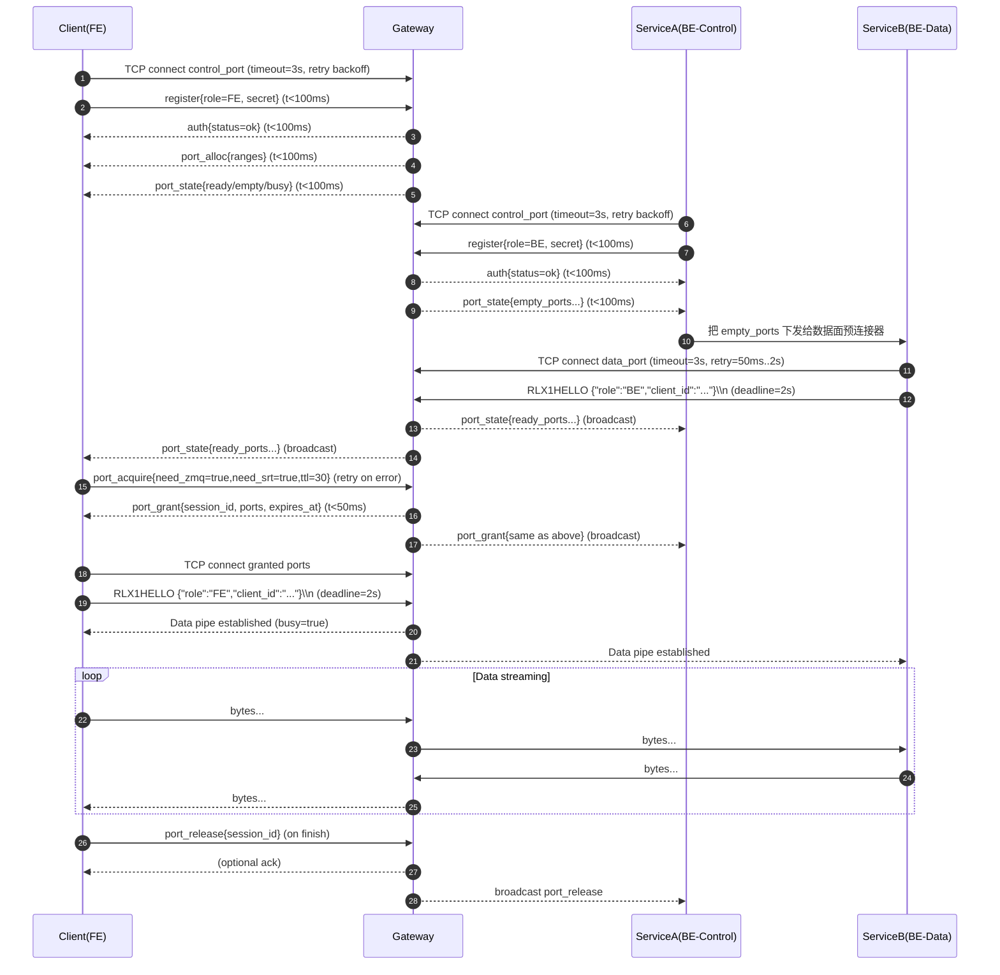

# JOJO-Relay-X 后端开发指导（基于当前测试与网关代码支持情况）

> 适用范围：本指导以当前仓库 `relay_X` 的实际实现为准（控制面为 TCP + JSON，数据面当前为 TCP 端口中转，`srt/zmq` 在现阶段是“端口协议标签”，并非真实 libsrt/ZeroMQ 协议栈）。  
> 关键入口：网关启动 [main.go](file:///home/ubuntu/codes/go_work/relay_X/cmd/relay-server/main.go)，控制面协议 [protocol.go](file:///home/ubuntu/codes/go_work/relay_X/v1/control/protocol.go)，数据面握手与配对 [server.go](file:///home/ubuntu/codes/go_work/relay_X/v1/relay/server.go)。

## 目录

- [1. 配置文件结构与配置方法](#1-配置文件结构与配置方法)
- [2. 连接建立全流程](#2-连接建立全流程)
- [3. 公钥/私钥生成与配置](#3-公钥私钥生成与配置)
- [4. 控制消息格式规范](#4-控制消息格式规范)
- [5. SRT传输建立](#5-srt传输建立)
- [6. ZeroMQ通信建立](#6-zeromq通信建立)
- [7. 资源回收与生命周期](#7-资源回收与生命周期)
- [8. 端口分配策略](#8-端口分配策略)
- [9. 内存分配策略](#9-内存分配策略)
- [10. 消息流时序图](#10-消息流时序图)
- [附加](#附加)

---

## 1. 配置文件结构与配置方法

### 1.1 当前代码支持的配置入口（现状）

当前网关配置由两部分组成：

- 静态配置（YAML）：固定读取 `configs/config.yaml`，加载结构为 `Config{ Relay, Log }`，入口 [loader.go](file:///home/ubuntu/codes/go_work/relay_X/v1/config/loader.go#L16-L73)。
- 敏感配置（JSON）：固定读取 `.env.local.json`，加载到 `Config.Env`（`relay_public_key`/`auth_secret`），入口同上。

注意：

- 当前 `Load()` 仅“读取并反序列化”，未实现配置热更新、未实现配置校验逻辑（`loader.go` 的注释中写了“校验”，但当前未落地）。  
- `relay_public_key` 目前仅被加载到结构体字段，仓库内尚未在业务逻辑中使用（无引用）；控制面存在 `key_exchange` 消息用于透传，但未用于消息签名/验签。

### 1.2 配置项清单（含含义、取值范围、示例）

配置文件示例见 [configs/config.yaml](file:///home/ubuntu/codes/go_work/relay_X/configs/config.yaml) 与 [.env.local.json](file:///home/ubuntu/codes/go_work/relay_X/.env.local.json)。

#### 1.2.1 `configs/config.yaml`

顶层结构：

```yaml
relay:
  max_fe: 2
  max_be: 2
  ring_buffer_size: 104857600
  reaper_timeout: 2s
  control_port: 5555
  zmq_start_port: 2350
  zmq_end_port: 2380
  srt_start_port: 2300
  srt_end_port: 2330
log:
  level: debug
```

字段说明（对应结构体 `RelayConfig`/[loader.go](file:///home/ubuntu/codes/go_work/relay_X/v1/config/loader.go#L16-L27)）：

| 配置项 | 类型 | 含义 | 取值范围/建议 | 示例 |
|---|---|---|---|---|
| `relay.max_fe` | int | 允许同时在线的 FE 控制连接上限（超过直接拒绝） | `>=1`，压测时需大于并发 FE 数 | `200` |
| `relay.max_be` | int | 允许同时在线的 BE 控制连接上限 | `>=1`，按后端服务实例数配置 | `50` |
| `relay.ring_buffer_size` | int64 | 单条数据面管道的环形缓冲上限（字节） | `>= 1MB`，常用 32MB~256MB；过大会抬高峰值内存 | `104857600` |
| `relay.reaper_timeout` | duration | BE 控制连接断开后的“熔断阈值”，超时会关闭对应数据面端口并回收会话 | `>= 0`；生产建议 2s~30s 结合重连窗口 | `2s` |
| `relay.control_port` | int | 控制面 TCP 监听端口（JSON 编解码） | `1-65535`，建议固定 | `5555` |
| `relay.zmq_start_port` | int | “ZMQ 协议标签”数据面端口段起始（当前实现为 TCP 监听） | `1-65535`，建议用一段连续端口 | `30101` |
| `relay.zmq_end_port` | int | “ZMQ 协议标签”数据面端口段结束 | `>= start` | `30200` |
| `relay.srt_start_port` | int | “SRT 协议标签”数据面端口段起始（当前实现为 TCP 监听） | `1-65535` | `30000` |
| `relay.srt_end_port` | int | “SRT 协议标签”数据面端口段结束 | `>= start` | `30100` |

字段说明（对应结构体 `LogConfig`/[loader.go](file:///home/ubuntu/codes/go_work/relay_X/v1/config/loader.go#L35-L37)）：

| 配置项 | 类型 | 含义 | 取值范围/建议 | 示例 |
|---|---|---|---|---|
| `log.level` | string | slog 日志等级 | `debug|info|warn|error`（按实现而定） | `info` |

#### 1.2.2 `.env.local.json`

顶层结构（对应结构体 `EnvConfig`/[loader.go](file:///home/ubuntu/codes/go_work/relay_X/v1/config/loader.go#L29-L33)）：

```json
{
  "relay_public_key": "-----BEGIN PUBLIC KEY-----\n...\n-----END PUBLIC KEY-----",
  "auth_secret": "dummy_secret"
}
```

字段说明：

| 配置项 | 类型 | 含义 | 取值范围/建议 | 示例 |
|---|---|---|---|---|
| `relay_public_key` | string | 网关对外公布的公钥（当前仅加载，不参与验签） | PEM 字符串；建议仅包含公钥 | `-----BEGIN PUBLIC KEY-----...` |
| `auth_secret` | string | 控制面注册鉴权密钥（网关侧与客户端侧一致即可） | 非空字符串；生产建议最少 32 字节随机串 | `dummy_secret` |

鉴权逻辑为“严格相等比较”，空密钥会导致全部拒绝，见 [auth.go](file:///home/ubuntu/codes/go_work/relay_X/v1/control/auth.go#L9-L16)。

### 1.3 开发/测试/生产三套环境配置模板

当前实现固定读取 `configs/config.yaml` 与 `.env.local.json`。为了在不改代码的前提下切换环境，建议用“文件覆盖/挂载”方式；为了从根上支持多环境，建议后续扩展 `Load()` 支持 `--config` / `RELAY_CONFIG` / `RELAY_ENV`。

#### 1.3.1 开发环境（dev）

`configs/config.dev.yaml`（模板）：

```yaml
relay:
  max_fe: 50
  max_be: 50
  ring_buffer_size: 33554432 # 32MB
  reaper_timeout: 10s
  control_port: 5555
  srt_start_port: 30000
  srt_end_port: 30020
  zmq_start_port: 30101
  zmq_end_port: 30120
log:
  level: debug
```

`.env.dev.json`（模板）：

```json
{
  "relay_public_key": "-----BEGIN PUBLIC KEY-----\nREPLACE_ME\n-----END PUBLIC KEY-----",
  "auth_secret": "dev_secret_replace_me"
}
```

#### 1.3.2 测试环境（test）

`configs/config.test.yaml`（模板）：

```yaml
relay:
  max_fe: 200
  max_be: 200
  ring_buffer_size: 67108864 # 64MB
  reaper_timeout: 5s
  control_port: 5555
  srt_start_port: 30000
  srt_end_port: 30100
  zmq_start_port: 30101
  zmq_end_port: 30200
log:
  level: info
```

`.env.test.json`（模板）：

```json
{
  "relay_public_key": "-----BEGIN PUBLIC KEY-----\nREPLACE_ME\n-----END PUBLIC KEY-----",
  "auth_secret": "test_secret_replace_me"
}
```

#### 1.3.3 生产环境（prod）

`configs/config.prod.yaml`（模板）：

```yaml
relay:
  max_fe: 1000
  max_be: 2000
  ring_buffer_size: 134217728 # 128MB
  reaper_timeout: 30s
  control_port: 5555
  srt_start_port: 30000
  srt_end_port: 30100
  zmq_start_port: 30101
  zmq_end_port: 30200
log:
  level: warn
```

`.env.prod.json`（模板）：

```json
{
  "relay_public_key": "-----BEGIN PUBLIC KEY-----\nREPLACE_ME\n-----END PUBLIC KEY-----",
  "auth_secret": "prod_secret_replace_me"
}
```

### 1.4 配置热更新与校验机制

#### 1.4.1 热更新（当前现状与推荐实现）

当前：未实现热更新；网关启动时在 [main.go](file:///home/ubuntu/codes/go_work/relay_X/cmd/relay-server/main.go#L15-L66) 调 `Load()` 后常驻。

推荐（两种方式任选一种或组合）：

1) 文件监听热更新（fsnotify）  
2) 信号触发热更新（SIGHUP），并记录“最后一次成功应用的配置版本”

建议的热更新边界：

- 允许运行期生效：`log.level`、`max_fe/max_be`（连接上限）、`reaper_timeout`
- 谨慎处理：端口段（变更会影响现存监听与会话）；建议“仅增量启停端口”，并在变更窗口内对外广播 `port_alloc` 与 `port_state`
- 不建议热更新：`auth_secret`（会导致新老客户端行为不一致）；需要专门的灰度/双密钥机制

推荐实现伪代码（示意）：

```go
type Applied struct {
  cfg config.Config
  rev uint64
}

func Reload() error {
  next, err := config.LoadIntoNew("configs/config.yaml", ".env.local.json")
  if err != nil { return err }
  if err := Validate(next); err != nil { return err }
  Apply(next)
  return nil
}
```

#### 1.4.2 配置校验（必须做的规则）

建议在 `Load()` 或其上层加入校验（当前仓库未实现）：

- `max_fe/max_be`：必须 `>=1`
- `ring_buffer_size`：建议 `>= 1<<20`（1MB），且上线需结合并发计算内存上限（见第 9 节）
- `reaper_timeout`：必须 `>=0`，且生产不建议小于 1s
- 端口段：`start/end` 必须都在 `1..65535`，且 `start<=end`
- 端口段冲突：SRT 与 ZMQ 端口段不得重叠；不得与 `control_port` 冲突
- `auth_secret`：必须非空，且生产建议最少 32 字节随机串

---

## 2. 连接建立全流程

### 2.1 需要建立的连接类型（按当前实现与规划）

| 连接类型 | 现状 | 用途 | 代码/说明 |
|---|---|---|---|
| TCP（控制面） | 已实现 | 注册、鉴权、端口分配/租用、心跳、遥测、日志 | [hub.go](file:///home/ubuntu/codes/go_work/relay_X/v1/control/hub.go) |
| TCP（数据面，标记为 `srt`） | 已实现（TCP 中转） | FE/BE 之间二进制数据双向转发 | [server.go](file:///home/ubuntu/codes/go_work/relay_X/v1/relay/server.go) |
| TCP（数据面，标记为 `zmq`） | 已实现（TCP 中转） | 同上；当前仅作为端口池的协议标签 | [server.go](file:///home/ubuntu/codes/go_work/relay_X/v1/relay/server.go) |
| SRT（真实 libsrt） | 未接入 | 低延迟/抗丢包传输 | 第 5 节给出接入指导 |
| ZeroMQ（真实 libzmq） | 未接入 | PUB/SUB、PUSH/PULL、REQ/REP 语义传输 | 第 6 节给出接入指导 |
| HTTP | 未实现（建议补充） | 健康检查、Prometheus metrics、pprof、管理 API | 建议新增 `/metrics` `/healthz` |

### 2.2 网关侧初始化顺序（实际代码顺序）

网关启动顺序以 [main.go](file:///home/ubuntu/codes/go_work/relay_X/cmd/relay-server/main.go#L15-L95) 为准：

1) 初始化日志系统 `common.InitLogger()`  
2) 加载配置 `config.Load()`  
3) 设置日志级别 `common.SetLogLevel(config.GlobalConfig.Log.Level)`  
4) 设置并初始化端口管理器的端口段 `control.GlobalPortManager.SetRanges(...)`  
5) 启动数据面端口监听：遍历端口段调用 `relay.GlobalRelay.StartRelayPortWithProtocol(port,"zmq"/"srt")`  
6) 注册数据面状态变化回调：变更时广播 `port_state` 给 FE/BE  
7) 启动控制面 TCP 监听 `control.StartServer()`（默认 `:5555`）

### 2.3 客户端侧（FE/BE）全流程与时序要点

#### 2.3.1 控制面（FE/BE 共同）

1) 建立 TCP 连接到 `gateway:control_port`  
2) 发送首条消息 `register`（必须是第一条，否则网关断开）  
3) 网关校验 `secret`（严格相等）通过后返回 `auth`  
4) 连接进入“长连接”状态，后续持续读写 JSON 消息

服务端要求“首条消息必须是注册”，见 [hub.go](file:///home/ubuntu/codes/go_work/relay_X/v1/control/hub.go#L182-L199)。

#### 2.3.2 端口池与“ready/busy/empty”含义（必须理解）

数据面端口在网关侧有三种状态（由 [server.go](file:///home/ubuntu/codes/go_work/relay_X/v1/relay/server.go#L262-L310) 统计并通过 `port_state` 下发）：

- `empty`：端口在监听，但没有 BE 预连接
- `ready`：端口在监听，且有 BE 预连接（pendingBE != nil），等待 FE 连接配对
- `busy`：端口已配对为会话（正在中转），拒绝新连接

关键约束（当前实现）：

- 一个端口同一时刻最多只能承载 1 个会话（busy 时拒绝连接）。
- FE 连接数据端口时，端口必须已经有 BE 预连接，否则 FE 会被拒绝（“尚无 BE 预连接”）。

#### 2.3.3 BE 的推荐初始化顺序（与当前测试程序一致）

参考 BE 模拟器 [server_test/main.go](file:///home/ubuntu/codes/go_work/relay_X/server_test/main.go#L60-L124)：

1) 连接控制面并 `register(BE)`  
2) 监听 `port_state`，对 `*_empty_ports` 里的端口发起数据面“预连接”  
3) 数据面预连接后发送 HELLO（详见 2.3.5），进入 pending 状态，端口变为 `ready`  
4) 等待 FE 发起 `port_acquire` 后，网关会广播 `port_grant`（当前 BE 模拟器也会订阅 `port_grant` 并按需连接）  

建议 BE 预连接策略：

- 维持一个“目标 ready 数量”的水位（watermark），例如：`ready_zmq >= N`、`ready_srt >= M`
- 低于水位则对 empty 端口补齐预连接；高于水位可主动断开部分 pending（需协议支持/未来扩展）

#### 2.3.4 FE 的推荐初始化顺序（与当前测试程序一致）

参考 FE 测试程序 [client_test/test_client.go](file:///home/ubuntu/codes/go_work/relay_X/client_test/test_client.go#L160-L226)：

1) 连接控制面并 `register(FE)`  
2) 收到 `port_alloc` 与初始 `port_state`（网关在 FE 注册成功后主动下发）  
3) FE 发送 `port_acquire`（建议只从 ready 池申请）  
4) 收到 `port_grant` 后，连接到指定数据端口并发送 HELLO（详见 2.3.5），与 BE 配对后开始数据转发  
5) 会话结束后发送 `port_release` 释放租约，避免端口长期被“保留”

网关侧 FE 的租用逻辑会优先从 ready 池获取（`AcquireFromReady`），见 [port_manager.go](file:///home/ubuntu/codes/go_work/relay_X/v1/control/port_manager.go#L137-L228)。

#### 2.3.5 数据面 HELLO 握手（当前实现）

数据面连接建立后，客户端必须在 2 秒内发送一行：

```text
RLX1HELLO {"role":"BE","client_id":"be-01"}\n
```

服务端读取方式见 [server.go](file:///home/ubuntu/codes/go_work/relay_X/v1/relay/server.go#L312-L339)，超时为 2 秒：

- role 仅接受 `"FE"`/`"BE"`
- 未发送或格式不正确：连接会被关闭

#### 2.3.6 超时参数与重连策略（建议值）

当前网关实现中与连接相关的“硬超时”：

- 数据面 HELLO 读超时：2s（服务端强制）  
- 控制面读写超时：网关侧未设置（由客户端自行设置更安全）  
- 熔断超时：`relay.reaper_timeout`（BE 控制连接断开后触发端口关闭，见 [reaper.go](file:///home/ubuntu/codes/go_work/relay_X/v1/control/reaper.go)）

建议客户端侧的超时/重连策略：

- 控制面 Dial 超时：1s~3s，TLS 场景可提高  
- 控制面读超时：按心跳周期 3 倍设置（例如心跳 1s，则读超时 3s）  
- 数据面 Dial 超时：1s~3s  
- 指数退避重连：50ms 起，倍增到 2s~5s，上限抖动（jitter）  
- 会话级 TTL：`port_acquire.ttl_seconds` 建议 10s~60s；超时后必须重试获取新端口  

### 2.4 连接池配置与最大并发数建议

#### 2.4.1 控制面并发

- 上限由 `relay.max_fe` 与 `relay.max_be` 限制，见 [hub.go](file:///home/ubuntu/codes/go_work/relay_X/v1/control/hub.go#L66-L86)。

#### 2.4.2 数据面并发

当前实现：一个端口同一时刻只能中转一个 FE-BE 会话，因此：

- `max_data_sessions(protocol)` ≈ 该协议端口段长度  
  - `zmq_sessions_max = zmq_end_port - zmq_start_port + 1`  
  - `srt_sessions_max = srt_end_port - srt_start_port + 1`
- 如果一次业务会话需要同时占用 ZMQ 与 SRT 两类端口，则“业务会话最大并发”约为：
  - `max_business_sessions = min(zmq_sessions_max, srt_sessions_max)`

建议：

- 生产端口段长度至少是峰值并发的 1.2~1.5 倍（留出重试与回收抖动空间）
- 若 FE 只从 ready 池申请端口，则 BE 必须维持足够的 ready 水位，否则 FE 会频繁拿到不可用端口或等待

---

## 3. 公钥/私钥生成与配置

### 3.1 OpenSSL 生成步骤

#### 3.1.1 RSA 2048

```bash
openssl genpkey -algorithm RSA -pkeyopt rsa_keygen_bits:2048 -out relay_rsa_2048.key
openssl rsa -in relay_rsa_2048.key -pubout -out relay_rsa_2048.pub
```

#### 3.1.2 ECDSA P-256

```bash
openssl ecparam -name prime256v1 -genkey -noout -out relay_ecdsa_p256.key
openssl ec -in relay_ecdsa_p256.key -pubout -out relay_ecdsa_p256.pub
```

### 3.2 证书/密钥存放目录与权限要求

建议目录规划（Linux）：

- `/etc/relay-x/keys/`：仅 root 或运行用户可读
- `/var/lib/relay-x/`：运行数据（非密钥）

权限建议：

- 私钥：`chmod 600 relay_*.key`（归属为运行用户）  
- 公钥：`chmod 644 relay_*.pub` 或更严格 `chmod 400`（按合规要求）  

避免把私钥直接写入 `.env.local.json` 这类可被误提交的文件；生产建议以 Secret/Volume 挂载方式注入。

### 3.3 代码中加载密钥的示例路径与错误处理（现状与建议）

现状：

- `.env.local.json` 仅加载 `relay_public_key` 与 `auth_secret`，见 [loader.go](file:///home/ubuntu/codes/go_work/relay_X/v1/config/loader.go#L29-L70)。
- 控制面存在 `key_exchange` 消息透传，但未实现基于密钥的签名/验签（见 [hub.go](file:///home/ubuntu/codes/go_work/relay_X/v1/control/hub.go#L292-L303)）。

建议实现（示例路径约定）：

- 公钥：`/etc/relay-x/keys/relay.pub`
- 私钥：`/etc/relay-x/keys/relay.key`

建议的加载与错误处理模式（Go 示例）：

```go
pubPEM, err := os.ReadFile("/etc/relay-x/keys/relay.pub")
if err != nil {
  return fmt.Errorf("读取公钥失败: %w", err)
}
block, _ := pem.Decode(pubPEM)
if block == nil {
  return fmt.Errorf("公钥 PEM 格式非法")
}
```

### 3.4 密钥轮换与过期告警策略

建议策略（生产必备）：

- 轮换机制：支持 `kid`（key id），允许同时加载“当前密钥 + 上一代密钥”用于验签；签名只使用当前密钥
- 轮换周期：RSA/ECDSA 私钥建议 90~180 天轮换（按安全策略）
- 过期告警：到期前 14 天、7 天、1 天告警；到期后进入降级/拒绝策略需明确
- 分发与回滚：密钥发布与回滚必须原子化（同一版本的配置、镜像、密钥集一致）

---

## 4. 控制消息格式规范

### 4.1 协议总览（现状）

控制面消息由统一信封承载：

- `type`: 消息类型
- `payload`: 各类型对应的载荷

定义见 [protocol.go](file:///home/ubuntu/codes/go_work/relay_X/v1/control/protocol.go#L15-L110)。

当前消息类型集合：

`register` / `auth` / `port_alloc` / `port_acquire` / `port_grant` / `port_release` / `port_state_q` / `port_state` / `key_exchange` / `ping` / `pong` / `telemetry` / `log`

### 4.2 JSON Schema（Draft 2020-12）

以下 Schema 以“当前实现字段”为主，并补充推荐字段用于可观测性与安全扩展（`msg_id/ts_ms/trace_id/sign` 等）。如需严格兼容当前实现，可只启用 `v1` 子集。

#### 4.2.1 Envelope（推荐 v1.1，兼容 v1）

```json
{
  "$schema": "https://json-schema.org/draft/2020-12/schema",
  "$id": "https://relay-x.example/schema/control-envelope.json",
  "title": "Relay-X Control Envelope",
  "type": "object",
  "additionalProperties": false,
  "properties": {
    "type": { "type": "string" },
    "payload": { "type": ["object", "null"] },
    "msg_id": { "type": "string", "description": "UUIDv4 + '-' + unix_ms" },
    "ts_ms": { "type": "integer", "minimum": 0, "default": 0 },
    "trace_id": { "type": "string", "default": "" },
    "sign": { "type": "string", "default": "", "description": "base64(signature)" },
    "kid": { "type": "string", "default": "", "description": "key id for verification" }
  },
  "required": ["type"],
  "oneOf": [
    { "$ref": "#/$defs/register" },
    { "$ref": "#/$defs/auth" },
    { "$ref": "#/$defs/port_alloc" },
    { "$ref": "#/$defs/port_acquire" },
    { "$ref": "#/$defs/port_grant" },
    { "$ref": "#/$defs/port_release" },
    { "$ref": "#/$defs/port_state_q" },
    { "$ref": "#/$defs/port_state" },
    { "$ref": "#/$defs/key_exchange" },
    { "$ref": "#/$defs/ping" },
    { "$ref": "#/$defs/pong" },
    { "$ref": "#/$defs/telemetry" },
    { "$ref": "#/$defs/log" }
  ],
  "$defs": {
    "register": {
      "type": "object",
      "properties": {
        "type": { "const": "register" },
        "payload": {
          "type": "object",
          "additionalProperties": false,
          "properties": {
            "role": { "type": "string", "enum": ["FE", "BE"] },
            "secret": { "type": "string", "default": "" },
            "client_id": { "type": "string", "default": "" }
          },
          "required": ["role"]
        }
      },
      "required": ["type", "payload"]
    },
    "auth": {
      "type": "object",
      "properties": {
        "type": { "const": "auth" },
        "payload": {
          "type": "object",
          "additionalProperties": true,
          "properties": {
            "status": { "type": "string", "default": "ok" }
          },
          "required": ["status"]
        }
      },
      "required": ["type", "payload"]
    },
    "port_alloc": {
      "type": "object",
      "properties": {
        "type": { "const": "port_alloc" },
        "payload": {
          "type": "object",
          "additionalProperties": false,
          "properties": {
            "zmq_start_port": { "type": "integer", "minimum": 1, "maximum": 65535 },
            "zmq_end_port": { "type": "integer", "minimum": 1, "maximum": 65535 },
            "srt_start_port": { "type": "integer", "minimum": 1, "maximum": 65535 },
            "srt_end_port": { "type": "integer", "minimum": 1, "maximum": 65535 }
          },
          "required": ["zmq_start_port", "zmq_end_port", "srt_start_port", "srt_end_port"]
        }
      },
      "required": ["type", "payload"]
    },
    "port_acquire": {
      "type": "object",
      "properties": {
        "type": { "const": "port_acquire" },
        "payload": {
          "type": "object",
          "additionalProperties": false,
          "properties": {
            "request_id": { "type": "string", "default": "" },
            "need_zmq": { "type": "boolean", "default": false },
            "need_srt": { "type": "boolean", "default": false },
            "ttl_seconds": { "type": "integer", "minimum": 1, "maximum": 600, "default": 30 }
          },
          "required": ["need_zmq", "need_srt"]
        }
      },
      "required": ["type", "payload"]
    },
    "port_grant": {
      "type": "object",
      "properties": {
        "type": { "const": "port_grant" },
        "payload": {
          "type": "object",
          "additionalProperties": false,
          "properties": {
            "request_id": { "type": "string", "default": "" },
            "session_id": { "type": "string" },
            "zmq_port": { "type": "integer", "minimum": 1, "maximum": 65535 },
            "srt_port": { "type": "integer", "minimum": 1, "maximum": 65535 },
            "expires_at": { "type": "integer", "minimum": 0 },
            "error": { "type": "string", "default": "" }
          },
          "required": ["session_id", "expires_at"]
        }
      },
      "required": ["type", "payload"]
    },
    "port_release": {
      "type": "object",
      "properties": {
        "type": { "const": "port_release" },
        "payload": {
          "type": "object",
          "additionalProperties": false,
          "properties": {
            "session_id": { "type": "string" }
          },
          "required": ["session_id"]
        }
      },
      "required": ["type", "payload"]
    },
    "port_state_q": {
      "type": "object",
      "properties": {
        "type": { "const": "port_state_q" },
        "payload": {
          "type": "object",
          "additionalProperties": false,
          "properties": {
            "need_zmq": { "type": "boolean", "default": false },
            "need_srt": { "type": "boolean", "default": false }
          }
        }
      },
      "required": ["type"]
    },
    "port_state": {
      "type": "object",
      "properties": {
        "type": { "const": "port_state" },
        "payload": {
          "type": "object",
          "additionalProperties": false,
          "properties": {
            "zmq_total": { "type": "integer", "minimum": 0 },
            "srt_total": { "type": "integer", "minimum": 0 },
            "zmq_busy": { "type": "integer", "minimum": 0 },
            "srt_busy": { "type": "integer", "minimum": 0 },
            "zmq_ready_ports": { "type": "array", "items": { "type": "integer" }, "default": [] },
            "srt_ready_ports": { "type": "array", "items": { "type": "integer" }, "default": [] },
            "zmq_empty_ports": { "type": "array", "items": { "type": "integer" }, "default": [] },
            "srt_empty_ports": { "type": "array", "items": { "type": "integer" }, "default": [] }
          },
          "required": ["zmq_total", "srt_total", "zmq_busy", "srt_busy", "zmq_ready_ports", "srt_ready_ports", "zmq_empty_ports", "srt_empty_ports"]
        }
      },
      "required": ["type", "payload"]
    },
    "key_exchange": {
      "type": "object",
      "properties": {
        "type": { "const": "key_exchange" },
        "payload": {
          "type": "object",
          "additionalProperties": false,
          "properties": {
            "public_key": { "type": "string" },
            "private_key": { "type": "string", "default": "" }
          },
          "required": ["public_key"]
        }
      },
      "required": ["type", "payload"]
    },
    "ping": {
      "type": "object",
      "properties": {
        "type": { "const": "ping" },
        "payload": {
          "type": "object",
          "additionalProperties": false,
          "properties": {
            "c_send": { "type": "integer", "minimum": 0 }
          },
          "required": ["c_send"]
        }
      },
      "required": ["type", "payload"]
    },
    "pong": {
      "type": "object",
      "properties": {
        "type": { "const": "pong" },
        "payload": {
          "type": "object",
          "additionalProperties": false,
          "properties": {
            "c_send": { "type": "integer", "minimum": 0 },
            "s_recv": { "type": "integer", "minimum": 0 },
            "s_send": { "type": "integer", "minimum": 0 }
          },
          "required": ["c_send", "s_recv", "s_send"]
        }
      },
      "required": ["type", "payload"]
    },
    "telemetry": {
      "type": "object",
      "properties": {
        "type": { "const": "telemetry" },
        "payload": {
          "type": "object",
          "additionalProperties": false,
          "properties": {
            "current_speed": { "type": "number", "minimum": 0, "default": 0 }
          },
          "required": ["current_speed"]
        }
      },
      "required": ["type", "payload"]
    },
    "log": {
      "type": "object",
      "properties": {
        "type": { "const": "log" },
        "payload": { "type": ["object", "string", "null"] }
      },
      "required": ["type"]
    }
  }
}
```

### 4.3 请求/响应/广播三类消息示例

#### 4.3.1 请求（FE -> 网关）：申请端口

```json
{
  "type": "port_acquire",
  "payload": {
    "request_id": "4d7d0fd1-2c55-4fd2-8e9b-2b8cb1d8de2f-1739577600000",
    "need_zmq": true,
    "need_srt": true,
    "ttl_seconds": 30
  }
}
```

#### 4.3.2 响应（网关 -> FE）：端口授予

```json
{
  "type": "port_grant",
  "payload": {
    "request_id": "4d7d0fd1-2c55-4fd2-8e9b-2b8cb1d8de2f-1739577600000",
    "session_id": "sess_01HZZZZZZZZZZZZZZZZZZZZZZZ",
    "zmq_port": 30110,
    "srt_port": 30010,
    "expires_at": 1739577630000,
    "error": ""
  }
}
```

#### 4.3.3 广播（网关 -> FE/BE）：端口状态推送

```json
{
  "type": "port_state",
  "payload": {
    "zmq_total": 100,
    "srt_total": 101,
    "zmq_busy": 3,
    "srt_busy": 2,
    "zmq_ready_ports": [30110, 30111],
    "srt_ready_ports": [30010, 30011],
    "zmq_empty_ports": [30112, 30113],
    "srt_empty_ports": [30012, 30013]
  }
}
```

### 4.4 消息 ID 生成规则（UUID v4 + 时间戳）

当前实现未在 Envelope 内包含 `msg_id` 字段（仅 `type/payload`）。为满足可追踪性与幂等处理，建议在客户端与服务端统一生成 `msg_id`：

- 规则：`msg_id = <uuid_v4> + "-" + <unix_ms>`
- 示例：`4d7d0fd1-2c55-4fd2-8e9b-2b8cb1d8de2f-1739577600000`

如需在现有协议上无损加字段：服务端 JSON 解码目前使用 `json.RawMessage`，未声明 Envelope 的额外字段，因此可在不改服务端的情况下由客户端先行携带；后续再逐步在服务端验证并落库/打点。

### 4.5 消息签名与验签伪代码

当前实现未做签名/验签；下面给出推荐方案，适用于“控制面消息不可篡改、可审计”的场景。

约定：

- 参与签名的字段：`type`、`payload`、`msg_id`、`ts_ms`、`trace_id`
- 序列化：对 `payload` 进行稳定序列化（canonical JSON），避免字段顺序差异导致验签失败
- 算法：RSA-PSS(SHA256) 或 ECDSA-P256(SHA256)

伪代码：

```text
function canonicalize(json_obj) -> bytes:
  return canonical_json_encode(json_obj)

function sign(envelope, privkey) -> string:
  body = canonicalize({
    "type": envelope.type,
    "payload": envelope.payload,
    "msg_id": envelope.msg_id,
    "ts_ms": envelope.ts_ms,
    "trace_id": envelope.trace_id
  })
  digest = SHA256(body)
  sig = SIGN(privkey, digest)  # RSA-PSS or ECDSA
  return base64(sig)

function verify(envelope, pubkey) -> bool:
  if abs(now_ms - envelope.ts_ms) > 30_000:
    return false
  body = canonicalize({ same fields as sign() })
  digest = SHA256(body)
  sig = base64_decode(envelope.sign)
  return VERIFY(pubkey, digest, sig)
```

---

## 5. SRT传输建立

### 5.1 当前支持情况说明（必须先读）

当前仓库中：

- “SRT”仅是数据端口的 `protocol` 标签（用于统计与端口池分类），底层仍为 `net.Listen("tcp")` + `net.Conn`。
- 未引入 libsrt，也没有 caller/listener/rendezvous 的真实 SRT 建连逻辑。

因此本节提供的是“接入 libsrt 的开发指导”，用于后续替换/增强当前 TCP 数据面。

### 5.2 libsrt 初始化参数（latency/maxbw/pbkeylen）

常用关键参数（示例值需要结合链路质量调优）：

- `latency`：接收端缓存（ms），影响抗抖动与端到端延迟
- `maxbw`：最大带宽（bps 或 bytes/s，视 API），可用于限速
- `pbkeylen`：预共享密钥长度（通常 16/24/32，对应 AES-128/192/256）

建议补充的参数：

- `rcvbuf`/`sndbuf`：发送/接收缓冲
- `mss`：最大分段大小
- `snddropdelay`：发送丢弃延迟窗口

### 5.3 caller/listener/rendezvous 三种模式代码模板（伪代码）

#### 5.3.1 caller（主动拨号）

```text
srt_startup()
sock = srt_create_socket()
srt_setsockopt(sock, LATENCY, 120)
srt_setsockopt(sock, MAXBW, 0)       # 0 表示不限制（按实现）
srt_setsockopt(sock, PBKEYLEN, 16)
srt_setsockopt(sock, PASSPHRASE, "secret...")
srt_connect(sock, remote_addr)
```

#### 5.3.2 listener（被动监听）

```text
srt_startup()
lsn = srt_create_socket()
srt_bind(lsn, :port)
srt_listen(lsn, backlog)
sock = srt_accept(lsn)
```

#### 5.3.3 rendezvous（双方同时主动）

```text
srt_startup()
sock = srt_create_socket()
srt_setsockopt(sock, RENDEZVOUS, 1)
srt_bind(sock, local_addr)
srt_connect(sock, remote_addr)
```

### 5.4 握手超时、NAK 重传、加密套件选择

建议：

- 握手超时：与控制面 `port_acquire.ttl_seconds` 协同，避免“拿到端口但 SRT 永远建不起来”
- NAK 重传：启用并设置上限，结合丢包率调优 `latency` 与 `rcvbuf`
- 加密套件：优先 AES-128（性能/安全折中），敏感场景可用 AES-256（更高 CPU）

### 5.5 性能调优指标：RTT、带宽利用率、丢包率

建议按会话/端口维度暴露指标：

- `srt_rtt_ms`：RTT
- `srt_send_rate_bps` / `srt_recv_rate_bps`：实时速率
- `srt_loss_percent`：丢包率
- `srt_retrans_packets_total`：重传包数

现有网关侧仅有基于字节计数的 `telemetry.current_speed`（Mbps），见 [hub.go](file:///home/ubuntu/codes/go_work/relay_X/v1/control/hub.go#L438-L483)。

---

## 6. ZeroMQ通信建立

### 6.1 当前支持情况说明

当前仓库中未接入 libzmq；“ZMQ”同样仅是端口协议标签与端口池分类。接入 ZeroMQ 需要引入依赖并改造数据面承载从“原始 TCP pipe”升级为“ZMQ socket”。

### 6.2 模式区分：PUB/SUB、PUSH/PULL、REQ/REP

建议将“业务语义”与“传输承载”分离：

- PUB/SUB：广播/订阅（适合状态推送、实时事件）
- PUSH/PULL：流水线分发（适合任务队列）
- REQ/REP：请求响应（适合轻量 RPC，需严格一问一答）

### 6.3 端口绑定规则（ephemeral range 30000-32767）

建议在生产统一使用一个“可控 ephemeral 段”用于动态绑定：

- 动态端口池：`30000-32767`（需结合系统 `ip_local_port_range` 与业务端口规划）
- 固定端口（若使用）：必须在防火墙白名单中显式放行

与本仓库现状对齐的建议：

- 将当前 `configs/config.yaml` 的端口段迁移到 30000+ 区间，避免与系统/其他服务冲突（见第 8 节端口规划表）

### 6.4 HWM、LINGER、RECONNECT_IVL 参数建议

关键参数建议（不同语言绑定名称略有差异）：

- `SNDHWM/RCVHWM`：高水位，控制内存与积压
  - 建议先按 `max_msg_size` 与 `max_conn` 计算上限，再给出 HWM
- `LINGER`：关闭时等待发送积压的时间（ms）
  - 建议控制面/短连接场景设为 0，避免退出卡住
- `RECONNECT_IVL`/`RECONNECT_IVL_MAX`：重连间隔
  - 建议与控制面重连策略一致，启用抖动

### 6.5 多线程上下文共享与线程安全示例

原则：

- 共享 Context：可以（Context 是线程安全的）
- Socket 线程安全：通常不安全；每个 socket 绑定到单线程使用，跨线程用 inproc/队列转发

示例（伪代码）：

```text
ctx = zmq_ctx_new()

thread A:
  sockA = zmq_socket(ctx, PULL)
  zmq_bind(sockA, "tcp://*:30110")

thread B:
  sockB = zmq_socket(ctx, PUSH)
  zmq_connect(sockB, "tcp://gateway:30110")
```

---

## 7. 资源回收与生命周期

### 7.1 RAII 封装模板（close 成对调用）

Go 侧推荐：

- 每种“外部资源”封装为具备 `Close() error` 的类型
- 用 `defer` 保证成对释放
- 对多资源组合使用 `multiCloser` 保证部分失败也能释放剩余资源

示例（Go）：

```go
type Closer func() error

type MultiCloser []Closer

func (m MultiCloser) Close() error {
  var first error
  for i := len(m) - 1; i >= 0; i-- {
    if err := m[i](); err != nil && first == nil {
      first = err
    }
  }
  return first
}
```

当前网关侧资源回收关键点：

- 控制连接关闭触发 `ReleaseAllForOwner` 并可能触发熔断，见 [hub.go](file:///home/ubuntu/codes/go_work/relay_X/v1/control/hub.go#L87-L117)
- 数据端口关闭会停止监听与会话并清理 pending，见 [server.go](file:///home/ubuntu/codes/go_work/relay_X/v1/relay/server.go#L198-L235)

### 7.2 智能指针与自定义 deleter 的使用

Go 无需手写智能指针；但引入 cgo（libsrt/libzmq）后建议：

- 将 C 资源句柄封装为 Go struct
- `runtime.SetFinalizer` 仅用于兜底，核心释放仍应由 `Close()` 显式调用
- 对“必须成对调用”的函数（如 `zmq_close`、`srt_close`）封装为 `defer` 安全点

### 7.3 Valgrind 内存泄漏检查命令与基准

对纯 Go 程序，Valgrind 价值有限；在接入 cgo（libsrt/ZeroMQ）后建议用 Valgrind 检查 C 层泄漏：

```bash
valgrind --leak-check=full --show-leak-kinds=all --track-origins=yes \
  --log-file=valgrind.log \
  ./relay-server
```

基准建议：

- “definitely lost” 必须为 0
- “indirectly lost” 必须为 0
- “still reachable” 需要评估第三方库常驻缓存是否可接受

### 7.4 文件描述符、socket、内存上限阈值

建议按三类资源设阈值与告警：

- FD（文件描述符）：`ulimit -n` 与实际占用
  - 每个控制连接 1 个 fd
  - 每个数据会话至少 2 个 fd（FE+BE）
  - 额外：监听端口数量也占 fd
- Socket：同 FD，需统计建立/关闭速率
- 内存：见第 9 节公式；并按 p95/p99 监控

---

## 8. 端口分配策略

### 8.1 端口段规划表（推荐）

建议统一使用以下规划（满足题设并避开常见系统端口）：

| 模块 | 端口范围 | 说明 |
|---|---:|---|
| SRT 数据面 | 30000-30100 | caller/listener/rendezvous 承载（未来接入 libsrt） |
| ZMQ 数据面 | 30101-30200 | PUB/SUB 等承载（未来接入 ZeroMQ） |
| HTTP 管理面 | 8080-8090 | /healthz /metrics /pprof（建议补充） |

当前仓库默认端口段为 2300~2380（见 [configs/config.yaml](file:///home/ubuntu/codes/go_work/relay_X/configs/config.yaml)），建议迁移到上述区间以降低冲突风险。

### 8.2 SO_REUSEADDR、SO_REUSEPORT 差异

简要结论：

- `SO_REUSEADDR`：允许端口在 TIME_WAIT 等情况下更快复用（不同系统语义略有差异）
- `SO_REUSEPORT`：允许多个 socket 绑定同一端口，由内核做负载均衡（多进程/多 worker 常用）

本项目当前使用 Go 标准库 `net.Listen("tcp", ":port")`，默认行为通常不启用 `SO_REUSEPORT`；如需多进程监听同端口，需要显式设置（需 `net.ListenConfig` + `Control` 钩子）。

### 8.3 动态端口申请与释放的 Go 代码示例

如果需要“动态申请一个可用端口”（不固定端口段），可以使用 `:0`：

```go
lc := net.ListenConfig{}
l, err := lc.Listen(context.Background(), "tcp", ":0")
if err != nil { return err }
defer l.Close()

port := l.Addr().(*net.TCPAddr).Port
_ = port
```

如果必须在特定端口段内申请（与本项目端口池一致），建议维护一个受锁保护的空闲列表，并在申请后立即“保留”（避免竞态）。

### 8.4 防火墙白名单脚本（iptables/nftables）

iptables（示例）：

```bash
iptables -A INPUT -p tcp --dport 5555 -j ACCEPT
iptables -A INPUT -p tcp --dport 30000:30200 -j ACCEPT
iptables -A INPUT -p tcp --dport 8080:8090 -j ACCEPT
iptables -A INPUT -m state --state ESTABLISHED,RELATED -j ACCEPT
iptables -A INPUT -j DROP
```

nftables（示例）：

```bash
nft add table inet relayx
nft add chain inet relayx input { type filter hook input priority 0 \; policy drop \; }
nft add rule inet relayx input ct state established,related accept
nft add rule inet relayx input tcp dport { 5555, 30000-30200, 8080-8090 } accept
```

---

## 9. 内存分配策略

### 9.1 tcmalloc/jemalloc 替换方案

纯 Go 程序默认使用 Go runtime 的内存分配器；一般不建议盲目替换。只有在确认“cgo 引入的 C 层大量分配”且出现碎片/抖动时，才考虑：

- 让 C 依赖链接 jemalloc/tcmalloc（取决于构建链路）
- 或将“高频分配”下沉为可复用对象池（更直接有效）

### 9.2 消息缓冲区池化设计（ring buffer、object pool）

本项目当前已有两级复用：

- 32KB 固定块 buffer pool（见 [memory.go](file:///home/ubuntu/codes/go_work/relay_X/v1/common/memory.go) 与 [buffer.go](file:///home/ubuntu/codes/go_work/relay_X/v1/relay/buffer.go#L74-L80)）
- 每会话的 `RingBuffer` 上限由 `relay.ring_buffer_size` 控制（见 [buffer.go](file:///home/ubuntu/codes/go_work/relay_X/v1/relay/buffer.go#L38-L45)）

建议继续优化的方向：

- 每连接读写 buffer 复用（对象池）
- 大消息分片与背压策略（避免单连接占满 ring buffer）
- 统一的 `max_msg_size` 限制与丢弃/降级策略

### 9.3 内存上限公式：max_conn × max_msg_size × 2

通用估算（单向 2 倍表示读写双缓冲或冗余）：

`mem_peak ≈ max_conn × max_msg_size × 2`

结合本项目的现实上限（每端口 1 会话 + 每会话 ring buffer 上限）：

`mem_peak ≈ max_sessions × ring_buffer_size + overhead`

其中：

- `max_sessions` 由端口段长度决定（见第 2 节）
- `ring_buffer_size` 为每条 pipe 的上限（`relay.ring_buffer_size`）

示例（生产估算）：

- SRT 101 个端口 + ZMQ 100 个端口，若每业务会话同时占两类端口，则 `max_sessions = 100`
- `ring_buffer_size = 128MB`
- 则仅 ring buffer 上限就可能达到 `100 × 128MB = 12.8GB`（需要非常谨慎）

因此生产建议：

- 降低 `ring_buffer_size`（例如 16MB~64MB）
- 加入会话级限速/背压，避免缓冲无限逼近上限

### 9.4 pprof/heaptrack 采样命令与火焰图生成步骤

pprof（Go）建议新增 HTTP 端点（例如 `:8080`），然后：

```bash
go tool pprof -http=:0 http://127.0.0.1:8080/debug/pprof/heap
go tool pprof -http=:0 http://127.0.0.1:8080/debug/pprof/profile?seconds=30
```

heaptrack 适用于 C/C++ 程序；若接入 cgo 并怀疑 C 层泄漏，可考虑对相关二进制做 heaptrack（取决于构建方式与符号）。

---

## 10. 消息流时序图

### 10.1 端到端交互（客户端 → 网关 → 服务A → 服务B）

说明：

- 当前仓库实现中，“网关”负责 FE/BE 控制面协商与数据面端口中转
- “服务A/服务B”可理解为 BE 内部两个逻辑模块：控制面客户端（A）与数据面处理器（B）



### 10.2 步骤耗时、重试、超时、错误码建议

当前实现错误返回方式主要体现在：

- 控制面：直接断开连接或在 `port_grant.error` 返回字符串（见 [hub.go](file:///home/ubuntu/codes/go_work/relay_X/v1/control/hub.go#L387-L396)）
- 数据面：HELLO 不合法/端口无 BE pending/端口 busy 直接断开

建议统一错误码（推荐扩展字段）：

- `error_code`：例如 `AUTH_FAILED` / `PORT_EXHAUSTED` / `TTL_EXPIRED` / `HELLO_INVALID` / `PORT_BUSY`
- `error`：人类可读信息（当前已有）

重试建议：

- `AUTH_FAILED`：不重试（直接告警）
- `PORT_EXHAUSTED`：指数退避重试，并触发 BE 扩容/预连接补水位
- `TTL_EXPIRED`：重新 `port_acquire`

### 10.3 Trace-Id 透传方法

建议在控制面 Envelope 增加 `trace_id` 并做到：

- FE 发起：生成 `trace_id`（如 16~32 字节 hex）
- 网关：不修改 trace_id，透传给 BE 广播与响应
- BE：在日志、指标、链路中统一使用该 trace_id

### 10.4 Prometheus 指标埋点名称（建议）

建议最少暴露以下指标（与题设对齐并补齐关键维度）：

- `srt_conn_total{role}`：SRT 数据连接总数（未来接入 libsrt 后）
- `zmq_conn_total{role}`：ZMQ 数据连接总数（未来接入 ZeroMQ 后）
- `zmq_msg_duration_seconds{pattern}`：消息处理耗时（REQ/REP 等）
- `relay_port_state{protocol,state}`：端口状态计数（ready/empty/busy）
- `relay_pipe_bytes_total{direction,protocol}`：转发字节计数（与当前 telemetry 一致但更可观测）

---

## 附加

### A. 开发环境一键启动 docker-compose.yml

当前仓库未提供 Dockerfile。本段给出“以 golang 官方镜像直接编译运行”的一键启动模板（开发用途），并用 volume 覆盖 `configs/config.yaml` 与 `.env.local.json`：

```yaml
services:
  relay-x:
    image: golang:1.23
    working_dir: /app
    volumes:
      - ./:/app
      - ./configs/config.yaml:/app/configs/config.yaml:ro
      - ./.env.local.json:/app/.env.local.json:ro
    command: ["bash", "-lc", "go mod download && go run ./cmd/relay-server"]
    ports:
      - "5555:5555"
      - "30000-30200:30000-30200"
      - "8080:8080"
```

如需把 BE/FE 测试一起编排，可在 compose 中追加：

- `server_test`（BE 模拟器）：运行 `go run ./server_test`
- `client_test`（FE 压测）：运行 `go run ./client_test load`

### B. 单元测试覆盖率要求（≥85%）

建议要求（CI 强制）：

- 总覆盖率 `>=85%`
- 关键模块 `>=90%`：`v1/control`（端口管理、鉴权、熔断）、`v1/relay`（配对逻辑、buffer/pipe）

常用命令（Go）：

```bash
go test ./... -coverprofile=coverage.out
go tool cover -func=coverage.out
```

### C. 压测脚本（wrk2、srt-live-server）

#### C.1 wrk2（用于 HTTP 管理面/业务 HTTP 接口）

由于当前网关未实现 HTTP 面，本脚本用于未来补齐 `/healthz`/`/metrics` 或业务 HTTP API 后的压测：

```bash
wrk2 -t4 -c200 -d30s -R1000 http://127.0.0.1:8080/healthz
```

#### C.2 srt-live-server（用于真实 SRT 链路压测）

未来接入 libsrt 后，可用 srt-live-server 做发送端/接收端基准。建议以“server + ffmpeg 推流/拉流”的方式构造压测链路：

1) 启动 srt-live-server（示例命令，实际按环境安装方式调整）：

```bash
sls -c sls.conf
```

`sls.conf`（最小示例，端口按需调整）：

```conf
listen 30000
mode live
```

2) ffmpeg 推流到 srt-live-server（示例）：

```bash
ffmpeg -re -stream_loop -1 -i ./client_test/IMG_4127.MOV \
  -c copy -f mpegts "srt://127.0.0.1:30000?mode=caller&latency=120"
```

3) ffmpeg 拉流（示例）：

```bash
ffmpeg -i "srt://127.0.0.1:30000?mode=caller&latency=120" -f null -
```

### D. 故障排查 checklist（telnet、tcpdump、strace）

1) 端口连通

```bash
telnet <gateway_ip> 5555
nc -vz <gateway_ip> 30000
```

2) 抓包定位握手与断连

```bash
tcpdump -i any -nn tcp port 5555 -vv
tcpdump -i any -nn tcp portrange 30000-30200 -vv
```

3) 系统调用与资源泄漏

```bash
strace -ff -p <pid> -e trace=network,desc -s 128
lsof -p <pid> | wc -l
```

4) 网关内部状态核对

- 是否达到 `max_fe/max_be` 上限（新连接会被拒绝）
- `port_state` 中 ready 是否足够（BE 是否预连接）
- 数据面 HELLO 是否在 2 秒内发送且格式正确

### E. 版本号与变更记录模板

```markdown
## [Unreleased]

### Added
- 

### Changed
- 

### Fixed
- 

### Security
- 

## [1.0.0] - YYYY-MM-DD

### Added
- 初始版本：控制面 TCP+JSON；数据面 TCP pipe；端口池与熔断机制
```
